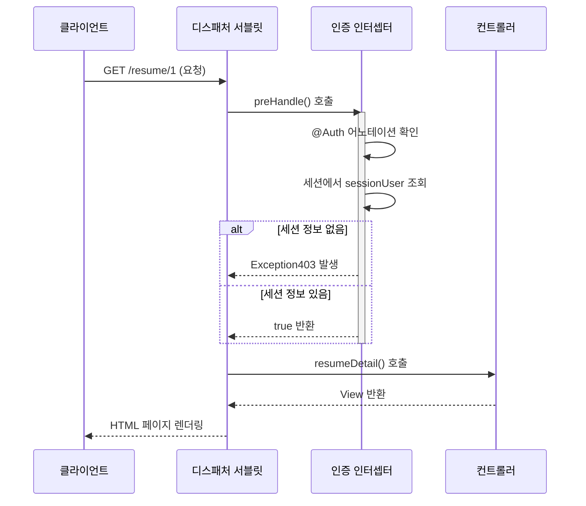
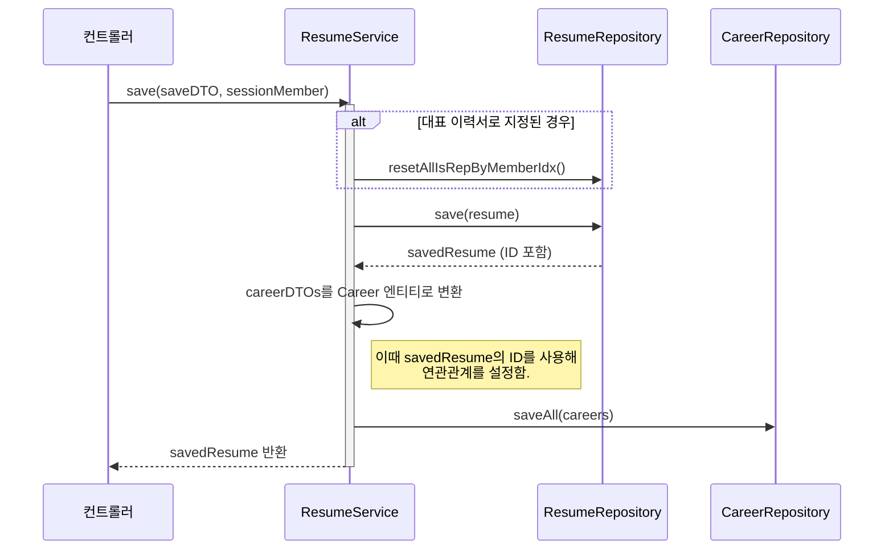
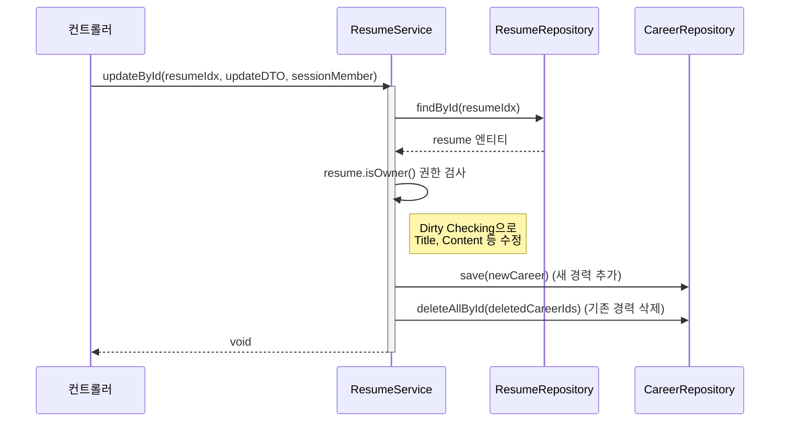

# 📠 JOIN(공고 지원 사이트)
---
## 개발프로그램 및 세부사항 
#### 개발 프로그램 : IntellJ Community
#### 개발 언어 및 프레임 워크 : JAVA(SpringBoot) - Mustahce 엔진 사용
#### 개발 DB : MySQL(8.0)
#### 개발 인원 : 4명 
#### 개발 기간 : 6/24 ~ 7/7 일 (18일)
---


# 로그인 및 회원 가입 기능 명세 


# 기업 공고 등록 및 지원하기 


# 📝 이력서(Resume) 및 경력(Career) 기능 명세

> 담당자: 조충희

## 1. 개요

이 프로젝트의 핵심 기능인 **이력서 및 경력 관리** 파트입니다.

사용자는 자신의 이력서를 생성, 조회, 수정, 삭제할 수 있으며, 각 이력서에 종속되는 상세 경력 정보들을 관리할 수 있습니다. 모든 기능은 **로그인 기반**으로 동작하며, **자신이 작성한 이력서에만 접근**할 수 있도록 제어됩니다.

## 2. 주요 기능 목록

-   [x] 이력서 목록 조회
-   [x] 이력서 상세 조회 (경력 정보 포함)
-   [x] 이력서 작성 및 저장
-   [x] 이력서 수정
-   [x] 이력서 삭제
-   [x] 이력서 소유자 확인을 통한 인가 처리

## 3. 화면-API 매핑

| 화면 (기능)             | HTTP Method | URL                               | Controller Method         | `@Auth` 필요 여부 |
| ----------------------- | ----------- | --------------------------------- | ------------------------- | ----------------- |
| 이력서 목록 페이지        | `GET`       | `/resume`                         | `resumeList()`            | O                 |
| 이력서 상세 페이지        | `GET`       | `/resume/{resumeIdx}`             | `resumeDetail()`          | O                 |
| 이력서 작성 페이지        | `GET`       | `/resume/save-form`               | `resumeSaveForm()`        | O                 |
| **이력서 작성 처리**      | `POST`      | `/resume/save`                    | `resumeSave()`            | O                 |
| 이력서 수정 페이지        | `GET`       | `/resume/{resumeIdx}/update-form` | `resumeUpdateForm()`      | O                 |
| **이력서 수정 처리**      | `POST`      | `/resume/{resumeIdx}/update`      | `resumeUpdate()`          | O                 |
| **이력서 삭제 처리**      | `POST`      | `/resume/{resumeIdx}/delete`      | `resumeDelete()`          | O                 |

## 4. 실제 화면
### 가. 이력서 목록

### 나. 이력서 상세보기

### 다. 이력서 상세보기 (기업회원)

### 라. 이력서 저장

### 마. 이력서 수정


## 5. 핵심 로직 및 설계 결정

### 가. 선언적 인증/인가 처리: `@Auth` 와 `AuthInterceptor`

-   **목적**: 인증/인가 로직 분리, 컨트롤러 중복 코드 제거
-   **동작**: AuthInterceptor가 @Auth 어노테이션 감지. 세션 확인 후 권한 없으면 Exception403 발생

### 다. 이력서 및 경력 동시 저장: 트랜잭션 관리

-   **목적**: 데이터 정합성 보장. Resume, Career 저장/실패 시 원자적 처리(All or Nothing)
-   **동작**: @Transactional 적용. Resume 저장 후 얻은 ID를 Career에 설정. saveAll로 DB I/O 최적화

### 라. 복합 이력서 수정: 더티 체킹, 명시적 관리

-   **목적**: 정보 수정, 경력 추가/삭제 동시 처리
-   **동작**: 소유권 검증. 기본 정보는 더티 체킹. 신규 경력은 save. 삭제 경력은 deletedCareerIds로 deleteAllById 호출


---
# 게시물 등록 및 기능 명세
담당자 : 유류진    participant AuthInterceptor as 인증 인터셉터
    participant ResumeController as 컨트롤러

    Client->>DispatcherServlet: GET /resume/1 (요청)
    DispatcherServlet->>AuthInterceptor: preHandle() 호출
    activate AuthInterceptor
    AuthInterceptor->>AuthInterceptor: @Auth 어노테이션 확인
    AuthInterceptor->>AuthInterceptor: 세션에서 sessionUser 조회
    alt 세션 정보 없음
        AuthInterceptor-->>DispatcherServlet: Exception403 발생
    else 세션 정보 있음
        AuthInterceptor-->>DispatcherServlet: true 반환
    end
    deactivate AuthInterceptor
    
    DispatcherServlet->>ResumeController: resumeDetail() 호출
    ResumeController-->>DispatcherServlet: View 반환
    DispatcherServlet-->>Client: HTML 페이지 렌더링
```
### 다. 이력서 및 경력 동시 저장: 트랜잭션 관리

-   **목적**: 데이터 정합성 보장. Resume, Career 저장/실패 시 원자적 처리(All or Nothing)
-   **동작**: @Transactional 적용. Resume 저장 후 얻은 ID를 Career에 설정. saveAll로 DB I/O 최적화

### 라. 복합 이력서 수정: 더티 체킹, 명시적 관리

-   **목적**: 정보 수정, 경력 추가/삭제 동시 처리
-   **동작**: 소유권 검증. 기본 정보는 더티 체킹. 신규 경력은 save. 삭제 경력은 deletedCareerIds로 deleteAllById 호출


---
# 📋 게시물 등록 및 기능 명세
담당자 : 유류진

