```mermaid
sequenceDiagram
    participant Controller as 컨트롤러
    participant Service as ResumeService
    participant ResumeRepo as ResumeRepository
    participant CareerRepo as CareerRepository

    Controller->>Service: save(saveDTO, sessionMember)
    activate Service
    alt 대표 이력서로 지정된 경우
        Service->>ResumeRepo: resetAllIsRepByMemberIdx()
    end
    Service->>ResumeRepo: save(resume)
    ResumeRepo-->>Service: savedResume (ID 포함)
    
    Service->>Service: careerDTOs를 Career 엔티티로 변환
    Note right of Service: 이때 savedResume의 ID를 사용해<br/>연관관계를 설정함.
    Service->>CareerRepo: saveAll(careers)
    
    Service-->>Controller: savedResume 반환
    deactivate Service
```

```mermaid
sequenceDiagram
    participant Controller as 컨트롤러
    participant Service as ResumeService
    participant ResumeRepo as ResumeRepository
    participant CareerRepo as CareerRepository

    Controller->>Service: updateById(resumeIdx, updateDTO, sessionMember)
    activate Service
    Service->>ResumeRepo: findById(resumeIdx)
    ResumeRepo-->>Service: resume 엔티티
    
    Service->>Service: resume.isOwner() 권한 검사
    
    Note right of Service: Dirty Checking으로<br/>Title, Content 등 수정
    
    Service->>CareerRepo: save(newCareer) (새 경력 추가)
    Service->>CareerRepo: deleteAllById(deletedCareerIds) (기존 경력 삭제)
    
    Service-->>Controller: void
    deactivate Service
```

# 📠 JOIN(공고 지원 사이트)
---
## 개발프로그램 및 세부사항 
#### 개발 프로그램 : IntellJ Community
#### 개발 언어 및 프레임 워크 : JAVA(SpringBoot) - Mustahce 엔진 사용
#### 개발 DB : MySQL(8.0)
#### 개발 인원 : 4명 
#### 개발 기간 : 6/24 ~ 7/7 일 (18일)
---


# 로그인 및 회원 가입 기능 명세 


# 기업 공고 등록 및 지원하기 

# 마이페이지

담당자 : 조현진

## 1.개요

마이페이지는 mustache로 개발하였으며 다른 프로젝트들과 연결되게 만들어져 있습니다
사용자는 마이페이지에서 자신의 사용정보를 확인할수 있으며 일반회원과 기업회원으로 나뉘어져있습니다.

## 2.주요 기능 목록

- 페이지 링크 기능
- 프로필
- 등록한이력서&지원내력&작성한게시물
- 등록공고
- 일반계정&기업계정분리

## 3.화면-API 매핑

## 화면 및 API 매핑 표 (`MainController` 기준)

| 경로 (URL)             | 설명                             | 요청 방식 | 반환 타입                       | View / JSON              | 인증 필요 | 접근 대상     |
|------------------------|----------------------------------|-----------|----------------------------------|---------------------------|------------|----------------|
| `/`                    | 메인 페이지 (최신 공고 8개 표시) | GET       | `String`                         | `index.mustache`          | ❌         | 전체 사용자    |
| `/api/recruits`        | 공고 리스트 AJAX API (페이징)     | GET       | `RecruitPageDTO` (JSON)          | JSON 응답                 | ❌         | 전체 사용자    |
| `/about`              | 팀 소개 페이지                    | GET       | `String`                         | `page/about.mustache`     | ❌         | 전체 사용자    |
| `/mypage`             | 일반회원 마이페이지               | GET       | `String`                         | `page/member-page.mustache` | ✅         | 일반회원 (`MEMBER`) |
| `/recruit/mypage`     | 기업회원 마이페이지               | GET       | `String`                         | `page/corp-page.mustache`   | ✅         | 기업회원 (`CORP`)   |

# 📝 이력서(Resume) 및 경력(Career) 기능 명세

> 담당자: 조충희

## 1. 개요

이 프로젝트의 핵심 기능인 **이력서 및 경력 관리** 파트입니다.

사용자는 자신의 이력서를 생성, 조회, 수정, 삭제할 수 있으며, 각 이력서에 종속되는 상세 경력 정보들을 관리할 수 있습니다. 모든 기능은 **로그인 기반**으로 동작하며, **자신이 작성한 이력서에만 접근**할 수 있도록 제어됩니다.

## 2. 주요 기능 목록

-   [x] 이력서 목록 조회
-   [x] 이력서 상세 조회 (경력 정보 포함)
-   [x] 이력서 작성 및 저장
-   [x] 이력서 수정
-   [x] 이력서 삭제
-   [x] 이력서 소유자 확인을 통한 인가 처리

## 3. 화면-API 매핑

| 화면 (기능)             | HTTP Method | URL                               | Controller Method         | `@Auth` 필요 여부 |
| ----------------------- | ----------- | --------------------------------- | ------------------------- | ----------------- |
| 이력서 목록 페이지        | `GET`       | `/resume`                         | `resumeList()`            | O                 |
| 이력서 상세 페이지        | `GET`       | `/resume/{resumeIdx}`             | `resumeDetail()`          | O                 |
| 이력서 작성 페이지        | `GET`       | `/resume/save-form`               | `resumeSaveForm()`        | O                 |
| **이력서 작성 처리**      | `POST`      | `/resume/save`                    | `resumeSave()`            | O                 |
| 이력서 수정 페이지        | `GET`       | `/resume/{resumeIdx}/update-form` | `resumeUpdateForm()`      | O                 |
| **이력서 수정 처리**      | `POST`      | `/resume/{resumeIdx}/update`      | `resumeUpdate()`          | O                 |
| **이력서 삭제 처리**      | `POST`      | `/resume/{resumeIdx}/delete`      | `resumeDelete()`          | O                 |

## 4. 실제 화면
### 가. 이력서 목록

### 나. 이력서 상세보기

### 다. 이력서 상세보기 (기업회원)

### 라. 이력서 저장

### 마. 이력서 수정


## 5. 핵심 로직 및 설계 결정

### 가. 선언적 인증/인가 처리: `@Auth` 와 `AuthInterceptor`

-   **목적**: 인증/인가 로직 분리, 컨트롤러 중복 코드 제거
-   **동작**: AuthInterceptor가 @Auth 어노테이션 감지. 세션 확인 후 권한 없으면 Exception403 발생

```mermaid
sequenceDiagram
    participant Client as 클라이언트
    participant DispatcherServlet as 디스패처 서블릿
    participant AuthInterceptor as 인증 인터셉터
    participant ResumeController as 컨트롤러

    Client->>DispatcherServlet: GET /resume/1 (요청)
    DispatcherServlet->>AuthInterceptor: preHandle() 호출
    activate AuthInterceptor
    AuthInterceptor->>AuthInterceptor: @Auth 어노테이션 확인
    AuthInterceptor->>AuthInterceptor: 세션에서 sessionUser 조회
    alt 세션 정보 없음
        AuthInterceptor-->>DispatcherServlet: Exception403 발생
    else 세션 정보 있음
        AuthInterceptor-->>DispatcherServlet: true 반환
    end
    deactivate AuthInterceptor
    
    DispatcherServlet->>ResumeController: resumeDetail() 호출
    ResumeController-->>DispatcherServlet: View 반환
    DispatcherServlet-->>Client: HTML 페이지 렌더링
```

### 다. 이력서 및 경력 동시 저장: 트랜잭션 관리

-   **목적**: 데이터 정합성 보장. Resume, Career 저장/실패 시 원자적 처리(All or Nothing)
-   **동작**: @Transactional 적용. Resume 저장 후 얻은 ID를 Career에 설정. saveAll로 DB I/O 최적화

### 라. 복합 이력서 수정: 더티 체킹, 명시적 관리

-   **목적**: 정보 수정, 경력 추가/삭제 동시 처리
-   **동작**: 소유권 검증. 기본 정보는 더티 체킹. 신규 경력은 save. 삭제 경력은 deletedCareerIds로 deleteAllById 호출


---
   participant AuthInterceptor as 인증 인터셉터
    participant ResumeController as 컨트롤러

    Client->>DispatcherServlet: GET /resume/1 (요청)
    DispatcherServlet->>AuthInterceptor: preHandle() 호출
    activate AuthInterceptor
    AuthInterceptor->>AuthInterceptor: @Auth 어노테이션 확인
    AuthInterceptor->>AuthInterceptor: 세션에서 sessionUser 조회
    alt 세션 정보 없음
        AuthInterceptor-->>DispatcherServlet: Exception403 발생
    else 세션 정보 있음
        AuthInterceptor-->>DispatcherServlet: true 반환
    end
    deactivate AuthInterceptor
    
    DispatcherServlet->>ResumeController: resumeDetail() 호출
    ResumeController-->>DispatcherServlet: View 반환
    DispatcherServlet-->>Client: HTML 페이지 렌더링
```
### 다. 이력서 및 경력 동시 저장: 트랜잭션 관리

-   **목적**: 데이터 정합성 보장. Resume, Career 저장/실패 시 원자적 처리(All or Nothing)
-   **동작**: @Transactional 적용. Resume 저장 후 얻은 ID를 Career에 설정. saveAll로 DB I/O 최적화

### 라. 복합 이력서 수정: 더티 체킹, 명시적 관리

-   **목적**: 정보 수정, 경력 추가/삭제 동시 처리
-   **동작**: 소유권 검증. 기본 정보는 더티 체킹. 신규 경력은 save. 삭제 경력은 deletedCareerIds로 deleteAllById 호출


---


# 📋 게시판 커뮤니티 기능

담당자 : 유류진


## 1. 📖 개요

이 프로젝트는 Spring Boot 기반으로 제작된 **커뮤니티 게시판 서비스**입니다.

- 사용자 인증 및 권한 제어를 통해 **자신의 게시글 및 댓글만 수정/삭제**할 수 있도록 구현되어 있으며,
- 게시글에는 **댓글, 답글, 좋아요, 이미지 업로드(미구현 업로드 실패시 오류메시지 출력만 가능)** 등의 기능이 포함됩니다.
- 목록은 **페이징, 정렬, 검색**이 가능하며,
- 사용자가 좋아요한 글, 댓글을 단 글, 본인의 글만 모아볼 수 있는 기능도 지원됩니다.

---

## 2. 🔧 주요 기능

### 📄 게시판

- 게시글 목록 조회 (페이징, 정렬, 검색 포함)
- 게시글 상세 보기
- 게시글 작성, 수정, 삭제
- 게시글 좋아요 / 좋아요 취소
- 내가 쓴 게시글 목록 조회
- 내가 좋아요한 게시글 목록 조회
- 내가 댓글 단 게시글 목록 조회
- 이미지 업로드 (Toast UI Editor) -> 너무 어려워서 중도 포기 벽느낌

### 💬 댓글

- 댓글 작성 (부모/자식 댓글 구조)
- 댓글 수정 / 삭제
- 비밀댓글 기능 (`isSecret` 처리)
- 본인만 댓글 수정/삭제 가능

### 🔐 인증

- 로그인 기반 인증 처리
- 본인만 수정/삭제 가능하도록 인가 처리
- 로그인하지 않으면 글쓰기/댓글 작성 불가

---

## 3. 🧩 화면-API 매핑표

| 화면 (기능)               | HTTP Method | URL                                         | Controller Method         | 로그인 필요 |
|---------------------------|-------------|---------------------------------------------|----------------------------|--------------|
| 게시글 목록 페이지        | GET         | `/board/list`                               | `listBoards()`             | ❌           |
| 게시글 상세 페이지        | GET         | `/board/{id}`                               | `viewBoard()`              | ❌           |
| 게시글 작성 페이지        | GET         | `/board/new`                                | `newBoardForm()`           | ✅           |
| 게시글 작성 처리          | POST        | `/board`                                    | `createBoard()`            | ✅           |
| 게시글 수정 페이지        | GET         | `/board/{id}/edit`                          | `editBoardForm()`          | ✅           |
| 게시글 수정 처리          | POST        | `/board/{id}/edit`                          | `updateBoard()`            | ✅           |
| 게시글 삭제 처리          | POST        | `/board/{id}/delete`                        | `deleteBoard()`            | ✅           |
| 게시글 좋아요 토글        | POST        | `/board/{boardId}/like`                     | `toggleLike()`             | ✅           |
| 내가 쓴 글 목록           | GET         | `/board/my-list`                            | `myBoards()`               | ✅           |
| 내가 좋아요한 글 목록      | GET         | `/board/likes`                              | `likedBoard()`             | ✅           |
| 내가 댓글 단 글 목록       | GET         | `/board/comments`                           | `myComments()`             | ✅           |
| 나의 게시글 목록 (페이징) | GET         | `/board/my-boards`                          | `myBoardsPaging()`         | ✅           |
| 게시글 전체 목록 (검색)   | GET         | `/board/boards`                             | `boardList()`              | ❌           |
| 댓글 작성 (Board)         | POST        | `/board/{boardId}/comment`                  | `writeComment()`           | ✅           |
| 댓글 작성 (Comment 전용)  | POST        | `/comments/{boardId}/comment`               | `writeComment()`           | ✅           |
| 댓글 수정                 | POST        | `/comments/{id}/edit`                       | `editComment()`            | ✅           |
| 댓글 삭제                 | POST        | `/comments/{id}/delete`                     | `deleteComment()`          | ✅           |

---

## 4. 🛠 기술 스택

| 구분        | 사용 기술 |
|-------------|------------|
| Language    | Java 17 |
| Framework   | Spring Boot 3.x |
| ORM         | Spring Data JPA |
| Template    | Mustache |
| Database    | MySQL |
| Build Tool  | Gradle |
| Editor      | Toast UI Editor (이미지 업로드 지원) |
| HTML 파싱   | Jsoup (댓글 내용 정제 처리) |
| Auth        | 세션 기반 로그인 (`SessionUser`) |

---


### 로그인을 해야만 글쓰기 가능


### 글쓰기 기능


### 글 삭제 기능


### 댓글 달기,수정,삭제,답글 기능


### 좋아요, 비밀 댓글 기능


### 페이징 정렬,조회,검색 기능


### 내가 댓글단 게시물,찜한,내 게시물 조회


